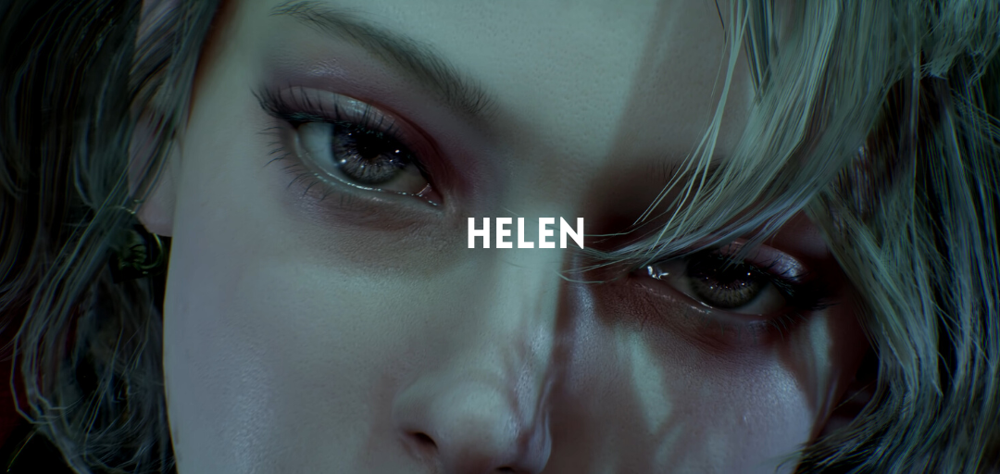
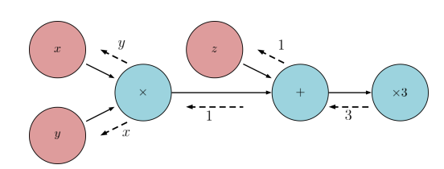

Helen is a fully differentiable dense SLAM framework. It provides a repository of differentiable building blocks for a dense SLAM system, such as differentiable nonlienar least squares solvers, differentiable ICP (iterative closest point) techniques, differentiable raycastring modules, and differentiable mapping / fusion blocks. One can use these blocks to construct SLAM systems that allow gradients to flow all the way from the outputs of the system (map, trajectory) to the inputs (raw color / depth images, parameters, calibration)

## information about SLAM

SLAM is technological mapping method that allows robots and other autonomous
vehicles to build a map and localize itself on that map at the same time.
using a wide range of algorithm, computation and other sensory data, SLAM software
system allow a robot or other vehicle like a drone or self-driving-car to ploat a
course through an unfamiliar environment while simultaneously identifying its own location
within that environment

## documentation (online documentation work in progress)
- [online documentation](https://slowy07.github.io/clifter_slam)

## online demo test
[point clouds living room](https://colab.research.google.com/drive/1QQQQ7XDop8JLL7uMeZ3FSCy6OhNk7CW0?usp=sharing)


## differentiable visual odometry
the beginnings of differentiable visual odometry can be traced back to seminal Lucas-Kanade iterative matching algorithm. apply the Lucas-Kanade algorithm to perform real-time dense visual odometry. Their system is differentiable, and has been extensively used for self-superviesd depth and motion estimation. coupled with the success of spatial transformer networks (STN), they can be used to perform dense visual odometry.

hoewever, extending differentiability beyodn the two view case (_frame-frame alingment_) is not starightforward. global consistency necessitates fusing measuerements from live frames into a global model (_model-frame alignment_) which is not trivially differentiable

## differentiable optimization
some approaches hava recently propesed to learn the optimization of nonlinera least squares objective functions. This is motivated by the fact that similiar cost functions have similar cost functions have similar loss landscape, and learning methods can help converge faster, or potientially to better

in BA-Net, the authors learn to predict the damping coefficient of the levenberg-marquardt optimizer, while in LS-Net, the authors entirely replace the levenberg marquad optimizer by an LSTM network. that predicts update steps. In GN-Net, a differentiable version of the Gauss-newton loss is used to show better bustness to wheather conditions.

## computational graphs


nodes in red represent variables, nodes in blue reresents operations on variables. Edges represent adata flow. this graph computes the function 3(xy + z).
dashed lines indicate (loca, i.e, per-node) gredients in the backward pass.

## installation and requirements

for the requirements you can see on [requirements.txt](requirements.txt)

install from github as pip package
```
pip install git+https://github.com/slowy/helen
```

to verify ``helen`` has success been built, test on python interperter and check by
```python
import helen as helen_slam
print(helen_slam.__version__)
```

## output


```python
rgbd_images = RGBDimages(color, depths, intrunsics)
slam = PointFusion()
pointclouds, recorvered_poses = slam(rgbd_images)
pointclouds.poltly(0).show()
```
